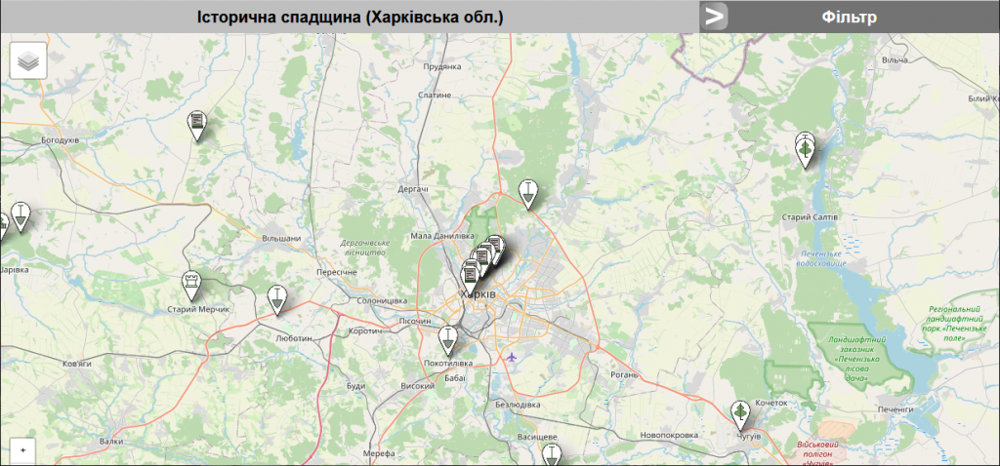
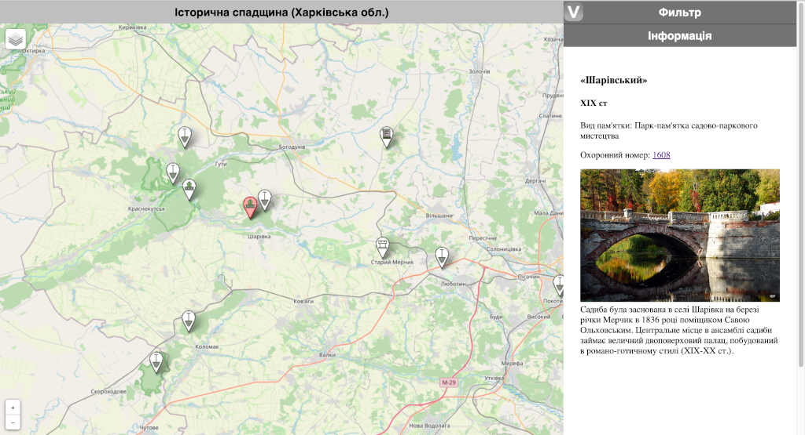
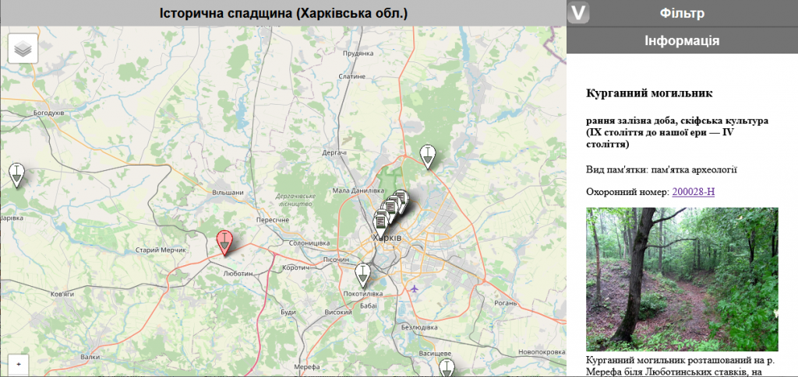
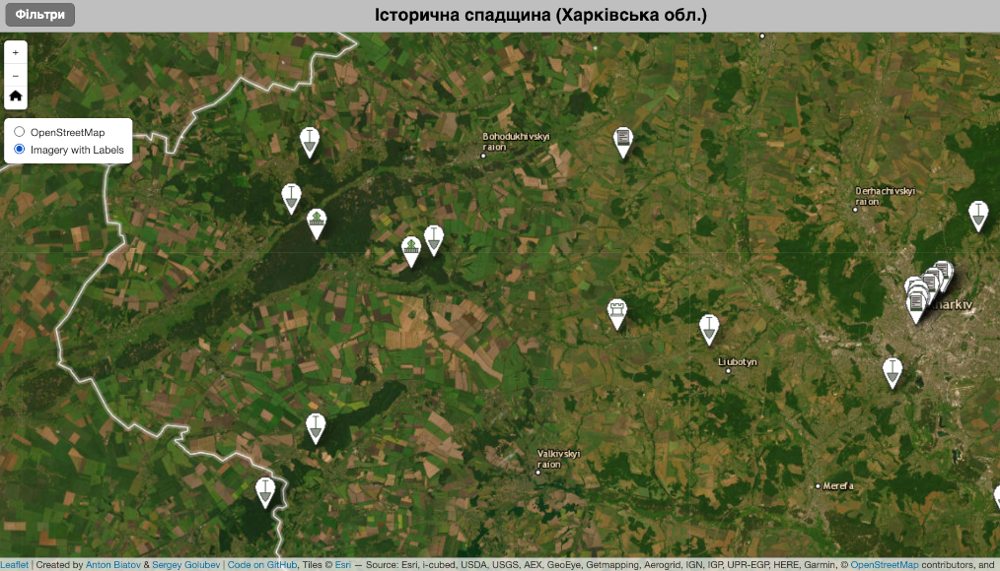

# Kharkiv history heritage, Ukraine (webmap)

Information about some historical and cultural monuments located in the Kharkiv region of Ukraine on the webmap.

Kharkiv region has a rich history. On its territory there are many evidences of the past – from ancient times to very recent history. Currently, on the territory of the Kharkiv region, 9449 monuments of cultural heritage are registered by the state, of which: 6895 monuments, 2475 historical monuments, 77 monuments of monumental art, 1 monument of archeology and history, 1 monument of history and monumental art.

The map shows only a small part of the monuments (35 objects).

The filter allows you to select monuments by the following parameters:

1. type of object (a complex of buildings, a grave, a house, a manor, a monument, an ancient settlement, a burial ground, a museum-reserve, a museum);

2. type of object (a monument of history, a monument of monumental art, a monument of archeology, a reserve, a park-monument of gardening art, an architectural monument);

3. object category (national value, local value).

At the moment, the map shows mainly monuments of national importance, in the future information about monuments of local importance will be added.

Different types of monuments are indicated with different icons. By clicking on an object on the map, you can get the following information about the object: name, date, type of monument, security number, photo (if available), and a brief description. From the security number, you can follow the link to go to the document that determines the conservation status of the object.

Information about the monuments and their images are taken from open sources, mainly from Wikipedia.

The app uses images of objects from third-party resources. For some points, the image may not display if the source image's URL has been modified.

The interface is Ukrainian.

OpenStreetMap and ESRI Imagery with Labels Basemap are available.

The application is based on the Leaflet JavaScript library.

[link >>](https://fra1.digitaloceanspaces.com/abspatial/demo/kharkiv-history-heritage/index.html)